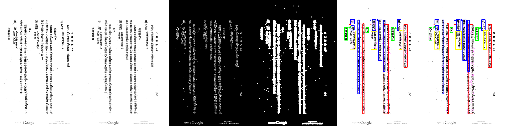
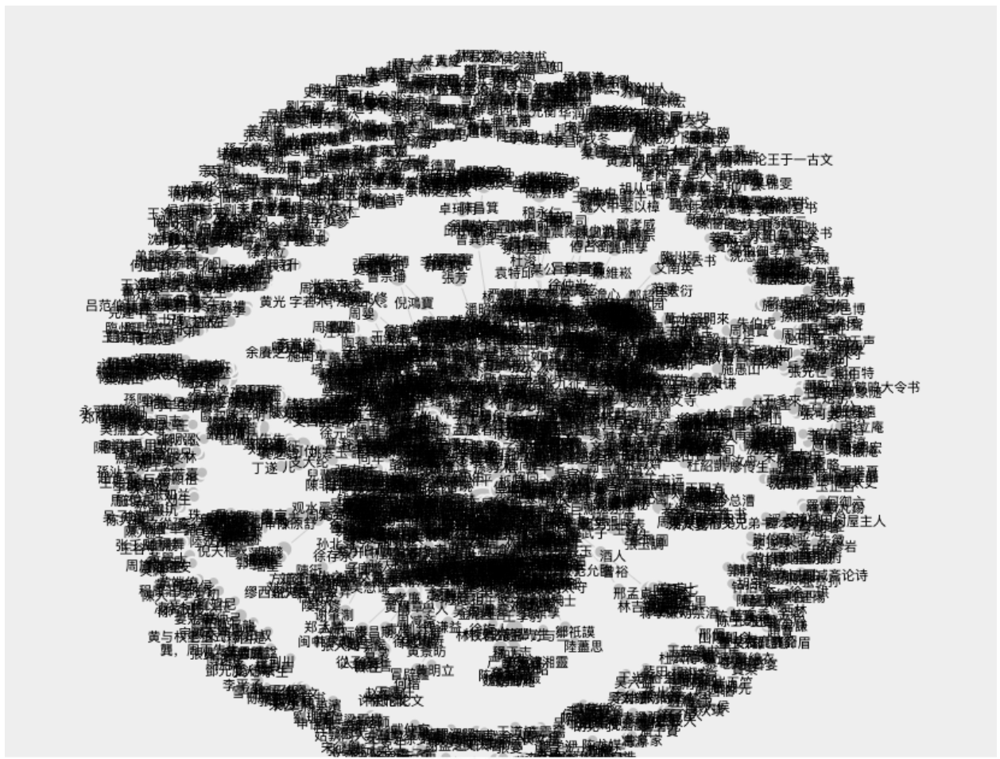
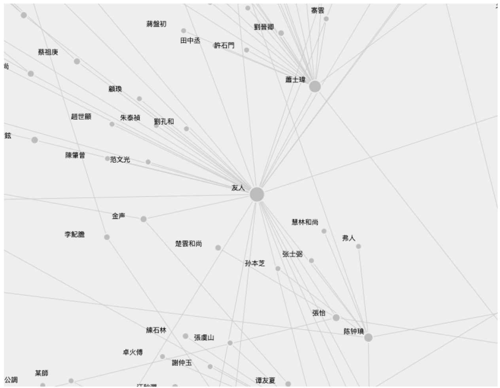
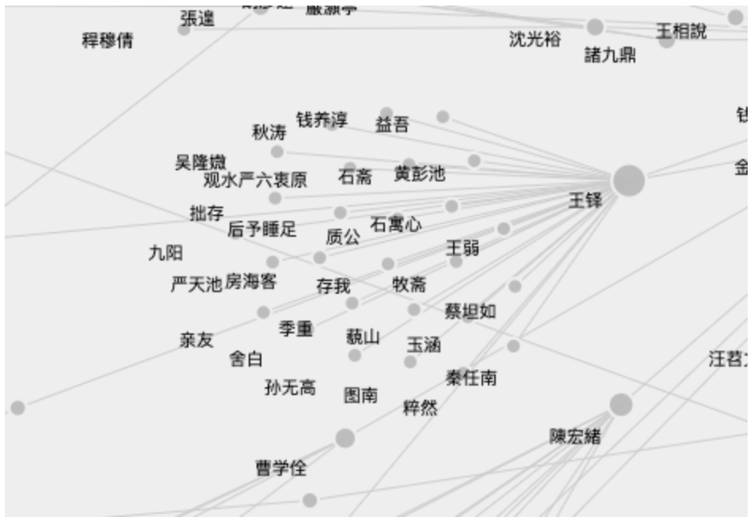
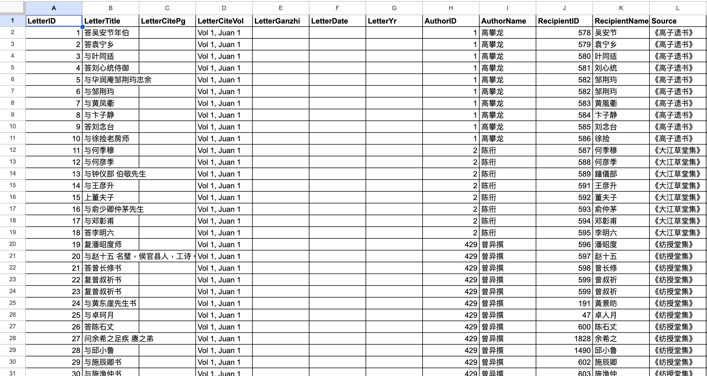

# Six Degrees of Zhou Lianggong: Scholar Networks and the Chidu xinchao

**Technologies Used:** Python, OpenCV, Pytesseract, Pandas, NumPy, Regular Expressions (Regex), NetworkX, Google Sheets

## Project Overview

This project explores the social networks of late Ming and early Qing dynasty scholars, mapping the extensive communication network of Zhou Lianggong through his published letter anthology, the *Chidu xinchao*. By leveraging digital history methodologies, this project reconstructs a historical database of scholarly communication to analyze the circulation of poetry, historical preservation efforts, and artisanal knowledge.

*Please note: The raw dataset and automated execution scripts are not publicly hosted. If you are interested in discussing the data, methodology, or running the code locally, please contact me directly.*

---

## 1. Text Extraction using OpenCV and Pytesseract

To extract the textual data from primary source images, this project utilizes Python's OpenCV (`cv2`) and Pytesseract libraries. Computer vision techniques are applied to preprocess the images, isolating text contours and improving Tesseract's optical character recognition (OCR) accuracy.

**Example Code:**

```python
import cv2
import pytesseract
from pytesseract import Output
import numpy as np
import os

# Configure tesseract executable path
pytesseract.pytesseract.tesseract_cmd = 'YOUR_DIRECTORY/tesseract'

# Load and preprocess the image
img = cv2.imread('YOUR_DIRECTORY/chidu_practice3.png')
imgContour = img.copy()

# Apply Gaussian blur and grayscale for better OCR results
imgBlur = cv2.GaussianBlur(img, (3,3), 1)
imgGray = cv2.cvtColor(imgBlur, cv2.COLOR_BGR2GRAY)

# Thresholding and contour mapping logic...

```



*Figure 1: Example of matching extracted OCR data to the appropriate relational categories.*

---

## 2. Text Cleaning and Preparation

Raw OCR output often contains formatting artifacts and noise. The extracted text undergoes a rigorous cleaning phase using regular expressions (`re` module). A series of Python scripts cleans spacing issues, fixes specific title characters, and strips out unintended English characters, numbers, and symbols. The cleaned sections are then concatenated into a master raw file for downstream processing using Pandas and NumPy.

**Example Code:**

```python
# -*- coding: utf-8 -*-
import re

# Open and read the extracted file
with open('YOUR_DIRECTORY/chi_du_xin_chao_raw.txt', 'r', encoding='utf-8') as ocr:
    text = ocr.readlines()

clean_text = []

# Clean specific characters, spacing, and unwanted symbols
for line in text:
    textline = re.search('(\w+)', line)

    if textline:
        noupper = re.sub('([A-Z]+)', '', line)
        nolower = re.sub('([a-z]+)', '', noupper)
        nonumbers = re.sub('\d+', '', nolower)
        nosymbol = re.sub('([\$\>\(\)\-\&\%\<\~\.\@\:\;\!]+)', '', nonumbers)
        nospaces = re.sub('( +)', '', nosymbol)
        clean_text.append(nospaces)

# Output cleaned text to a new file
with open('YOUR_DIRECTORY/chi_du_xin_chao_clean.txt', 'w') as newtext:
    for item in clean_text:
        newtext.write(item)

```

---

## 3. Database Design

The final component is a relational database specifically tailored to support historical Social Network Analysis (SNA), managed and structured using Google Sheets before network implementation.

* **Schema Design:** Adapted from the Chinese Biographical Database (CBDB) and Republic of Letters research.
* **Core Tables:** Data is systematically sorted into three central tables: letters, people, and places.
* **Handling Nuance:** The schema includes multiple categories for names to account for differences between a scholar's name of address and their birth name.
* **Creating the Network:** Within the letters category, data is strictly organized by senders and recipients, establishing the directed edges necessary for calculating in-degree (letters received) and out-degree (letters sent).


---

## 4. Network Analysis, Results, and Impact

By structuring the database relationally, the data seamlessly integrates with network analysis packages. Calculating shortest paths and betweenness/closeness centralities made it possible to map how influence moved through Zhou Lianggong's 17th-century network.

The network analysis yielded three primary historical insights:

1. **Circulation of Poetry:** The network reveals how poetic exchange acted as a primary mechanism for social cohesion and network resilience during a period of intense political transition.
2. **Historical Preservation:** Analysis of the correspondence highlights a coordinated, network-wide effort to preserve Ming dynasty historical memory and texts among connected scholars.
3. **Artisanal Knowledge:** The data maps the elevation and integration of artisanal knowledge, showing how painters, craftsmen, and scholars shared specialized information across traditional class boundaries.

### Key Network Metrics

The following table summarizes the most significant centrality data extracted from the network (as detailed in the project's appendix), highlighting the key figures who anchored this scholarly community.

| Name | Degree Centrality | Betweenness Centrality | Closeness Centrality | Network Role |
| --- | --- | --- | --- | --- |
| **Zhou Lianggong** | Highest | Highest | Highest | Primary Hub / Anchor |
| **Huang Yuji** | High | High | High | Major Information Broker |
| **Wang Hui** | Moderate | Moderate | High | Key Artistic Node |
| **Hu Yukun** | Moderate | Low | Moderate | Peripheral Specialist |


### Network Visualizations


*Figure 2: Macro view of the Chidu xinchao scholar network.*


*Figure 3: Clustered community focus.*


*Figure 4: Directed edge visualization showing the flow of correspondence between key nodes.*


*Figure 5: Screenshot of the letter sheet for the relational database.*